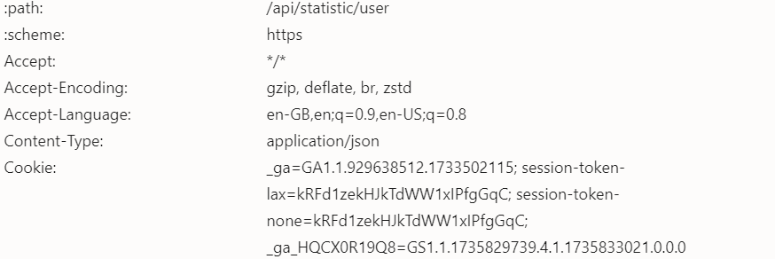

---

<h1 align="center">Terminal Station Bot</h1>

<p align="center">Automate tasks in Terminal Station for improved efficiency and results!</p>

---

## 🚀 **About the Bot**

This bot is designed to automate various tasks on Terminal Station, such as:

- **Harvesting**
- **Completing Quests**
- **Coin Flip Game**
- **Account Switching**

With this bot, you can save time and achieve optimal results without manual intervention.

---

## 🌟 **Version v1.0.0**

This is the initial version of the Terminal Station Bot.

---

## 📥 **Registration**

Sign up and start using Terminal Station via the link below:

<div align="center">
  <a href="https://t.me/terminalgame_bot/terminalgame?startapp=TSATMM8E&startApp=TSATMM8E" target="_blank">
    
  </a>
</div>

---

## ⚙️ **Configuration `config.json`**

| **Function**           | **Description**                                     | **Default** |
| ---------------------- | --------------------------------------------------- | ----------- |
| `harvest`              | Automatically harvest rewards                        | `true`      |
| `quest`                | Complete quests automatically                       | `true`      |
| `game_coin_flip`       | Play the coin flip game automatically               | `true`      |
| `delay_loop`           | Delay before repeating the loop (in milliseconds)   | `3000`      |
| `delay_account_switch` | Delay before switching accounts (in seconds)        | `10`        |

---

## 📖 **Installation Guide**

1. **Clone the Repository**  
   Clone this project to your local machine:

   ```bash
   git clone https://github.com/your-repository/terminal-station-bot.git
   ```

2. **Navigate to the Project Directory**  
   Change your terminal directory to the project folder:

   ```bash
   cd terminal-station-bot
   ```

3. **Install Dependencies**  
   Make sure all required libraries are installed:

   ```bash
   pip install -r requirements.txt
   ```

4. **Configure Query**  
   Input your Terminal Station cookie into the `query.txt` file.

5. **Run the Bot**  
   Execute the bot with the following command:

   ```bash
   python main.py
   ```

---

## 🚀 **Main Features**

- **Auto Harvest**: Harvest rewards automatically.
- **Auto Quest Completion**: Complete quests with no manual effort.
- **Auto Coin Flip Game**: Participate in the coin flip game automatically.
- **Auto Account Switch**: Switch between accounts automatically.

---

## 🛠️ **Contributing**

This project is developed by **LIVEXORDS**. If you have any suggestions or would like to contribute, reach out to us via the link below:

<div align="center">
  <a href="https://t.me/livexordsscript" target="_blank">
    
  </a>
</div>

---

## 📄 **Query.txt Notes**

Please input your **Terminal Station cookie** into the `query.txt` file. 

> **Note**: You need to update the cookie frequently as it is only a token that may expire.

---

## 📸 **Cookie Setup Tutorial**

Follow these steps to obtain your cookie for `query.txt`:

1. Right-click on the Terminal Station page and select **Inspect**.
2. Go to the **Network** tab.
3. Look for an API with the link `https://app.0xterminal.game/api/statistic/user`.
4. Scroll down and find the **cookie** variable, then copy it.
5. Paste the cookie into the `query.txt` file.

<div align="center">
  
</div>

---